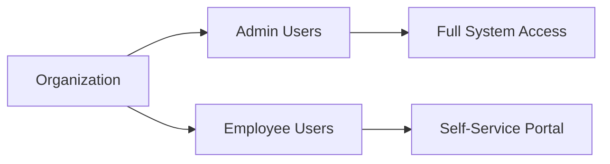

# Chapter 2 — Introduction

## 2.1 Overview

The **Employee Management System (EMS)** is a full-stack web application designed to digitize and automate the day-to-day operations of managing employees within an organization. It replaces traditional paper-based and spreadsheet-driven workflows with a centralized, role-based platform accessible from any modern web browser.

## 2.2 Background

In today's fast-paced corporate environment, efficient human resource management is critical for organizational success. Managing employee data, tracking attendance and presence, processing leave requests, and disseminating announcements are recurring tasks that consume significant time when performed manually.

This project was developed as a college capstone project to demonstrate end-to-end software engineering skills — from requirement gathering and system design through implementation, testing, and deployment using industry-standard tools.

## 2.3 Scope

The system caters to two primary user roles:

| Role       | Capabilities                                                                                         |
| ---------- | ---------------------------------------------------------------------------------------------------- |
| **Admin**  | Manage employees (CRUD), manage departments, approve/reject leaves, publish announcements, configure system settings, create database backups, view dashboard analytics, export reports (PDF/Excel) |
| **Employee** | View/edit own profile, apply for leaves, view announcements, update presence status, receive notifications |

## 2.4 Key Features

- **Dashboard & Analytics** — Real-time stats with chart visualizations (total employees, on-leave today, pending requests, per-department distribution).
- **Employee Management** — Full CRUD with avatar upload, department assignment, search/sort/filter.
- **Department Management** — Create, rename, delete departments with live member counts.
- **Leave Management** — Apply for casual, sick, annual, or WFH leave; admin approval/rejection workflow.
- **Announcements** — Publish organization-wide announcements with real-time notification delivery.
- **Presence Tracking** — Employees set their online/away/offline/out-of-office status in real time via WebSockets.
- **Notifications** — Real-time, in-app notification bell powered by Laravel Reverb (WebSocket).
- **Backup & Restore** — One-click database backup with download capability.
- **Feature Flags** — Admins can enable/disable modules (leave, announcements, presence, backup) from settings.
- **Containerized Deployment** — Entire stack runs via a single `docker compose up` command.

## 2.5 Users of the System

