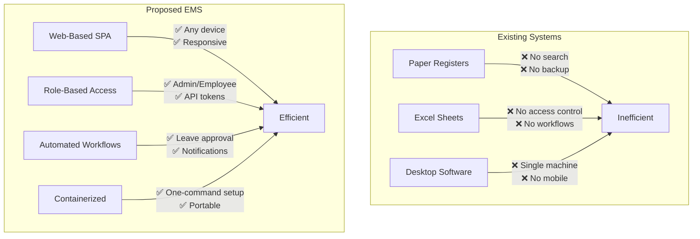

# Chapter 4 — Problems in Existing Systems

## 4.1 Offline / Paper-Based Systems

Many organizations still use **paper registers** and **physical filing cabinets** to store employee records.

| Limitation                         | Description                                                               |
| ---------------------------------- | ------------------------------------------------------------------------- |
| No search capability               | Finding a specific employee's record requires manual browsing              |
| Physical damage risk               | Paper records can be lost, damaged by water/fire, or misplaced             |
| No concurrent access               | Only one person can view a file at a time                                  |
| No backup                          | If the register is lost, there is no recovery mechanism                    |
| Slow leave processing              | Employee fills a paper form → manager signs → HR records → days of delay   |

## 4.2 Spreadsheet-Based Systems (Excel / Google Sheets)

Some organizations graduate to Excel or Google Sheets, but these introduce their own problems:

| Limitation                         | Description                                                               |
| ---------------------------------- | ------------------------------------------------------------------------- |
| No role-based access               | Anyone with the file link can view/edit all data                           |
| Data integrity issues              | No validation — incorrect dates, duplicate entries, formula errors          |
| No workflow automation             | Leave approval still requires manual email follow-ups                      |
| No real-time notifications         | Employees are not notified of approval/rejection instantly                  |
| Scalability ceiling                | Performance degrades with 500+ rows; no relational data                    |
| No audit trail                     | Hard to track who changed what and when                                    |

## 4.3 Legacy Desktop Applications

Older HR management tools (e.g., desktop-installed software, MS Access databases):

| Limitation                         | Description                                                               |
| ---------------------------------- | ------------------------------------------------------------------------- |
| Single-machine access              | Installed on one PC; no remote access                                      |
| No mobile/tablet support           | Not responsive; unusable on modern devices                                 |
| OS dependency                      | Often Windows-only; requires specific runtime versions                     |
| Expensive licensing                | Commercial HR software costs ₹50,000–₹5,00,000+ per year                  |
| No real-time features              | No WebSocket-based presence or instant notifications                       |
| Difficult deployment               | Requires manual installation per machine; no containerization              |

## 4.4 Comparison: Existing vs. Proposed System

## 4.5 Summary

| Feature                  | Paper | Excel | Desktop App | **EMS (Proposed)** |
| ------------------------ | ----- | ----- | ----------- | ------------------ |
| Multi-user access        | ❌    | ⚠️     | ❌          | ✅                  |
| Role-based security      | ❌    | ❌     | ⚠️          | ✅                  |
| Leave workflow           | ❌    | ❌     | ⚠️          | ✅                  |
| Real-time notifications  | ❌    | ❌     | ❌          | ✅                  |
| Presence tracking        | ❌    | ❌     | ❌          | ✅                  |
| Dashboard & reports      | ❌    | ⚠️     | ⚠️          | ✅                  |
| Mobile responsive        | ❌    | ⚠️     | ❌          | ✅                  |
| One-command deployment   | N/A   | N/A   | ❌          | ✅                  |
| Backup & restore         | ❌    | ⚠️     | ❌          | ✅                  |
| Cost                     | Low   | Low   | High        | **Free (open-source)** |
