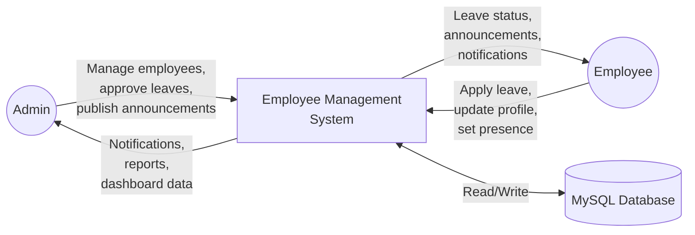
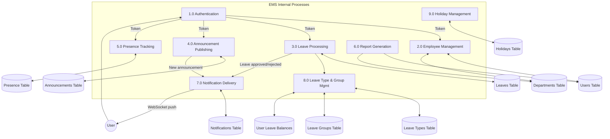

# Chapter 6 — System Analysis

## 6.1 Requirement Analysis

### 6.1.1 Functional Requirements

| Module          | Requirement                                                                     |
| --------------- | ------------------------------------------------------------------------------- |
| Authentication  | Users must log in with email and password to obtain an API token                 |
| Profile         | Users can view and update their own profile (name, phone, bio, position, avatar) |
| Employees       | Admins can list, create, update, and delete employee accounts                    |
| Departments     | Admins can create, rename, and delete departments; assign employees              |
| Leave           | Employees submit leave requests; admins approve/reject; both see status          |
| Leave Types     | Admins manage leave categories (casual, sick, annual, WFH, custom) with default balances |
| Leave Groups    | Admins create balance policies (groups) with custom balances per leave type      |
| Leave Balances  | System tracks per-employee leave balances; supports provisioning and monthly view |
| Holidays        | Admins manage country-specific public holidays; excluded from leave calculations |
| Announcements   | Admins create announcements; all users can view and search                       |
| Presence        | Employees update their status; status visible in employee lists                  |
| Notifications   | System delivers real-time notifications via WebSocket; users mark as read        |
| Dashboard       | Admins see aggregate stats and per-department charts; employees see personal dashboard |
| Help Guide      | Contextual per-page user guide accessible via help icon in the navbar            |
| Settings        | Admins toggle feature flags for individual modules                               |
| Backup          | Admins trigger database backup and download backup files                         |
| Reports         | Admins download PDF and Excel reports from the dashboard                         |

### 6.1.2 Non-Functional Requirements

| Category        | Requirement                                                      |
| --------------- | ---------------------------------------------------------------- |
| Performance     | API response time < 200ms for CRUD operations                    |
| Scalability     | Containerized design allows horizontal scaling                   |
| Security        | All endpoints authenticated via Sanctum tokens; passwords hashed |
| Usability       | Responsive UI works on 360px (mobile) through 1920px (desktop)   |
| Reliability     | Database backup mechanism available for disaster recovery        |
| Maintainability | Modular backend architecture; each module self-contained         |
| Portability     | Runs on any machine with Docker installed                        |

## 6.2 Feasibility Study

### 6.2.1 Technical Feasibility

| Component    | Technology      | Maturity | Availability |
| ------------ | --------------- | -------- | ------------ |
| Backend      | Laravel 13 / PHP 8.3 | Stable   | Open-source  |
| Frontend     | React 19 / Vite 8    | Stable   | Open-source  |
| Database     | MySQL 8.0            | Stable   | Open-source  |
| WebSocket    | Laravel Reverb       | Stable   | Open-source  |
| Deployment   | Docker Compose       | Stable   | Open-source  |

All technologies are open-source, well-documented, and widely adopted — **technically feasible**.

### 6.2.2 Economic Feasibility

| Item              | Cost   |
| ----------------- | ------ |
| Development tools | ₹0 (VS Code, Docker Desktop — free)    |
| Framework/runtime | ₹0 (all open-source)                   |
| Hosting (dev)     | ₹0 (localhost via Docker)               |
| Hosting (prod)    | ₹500–₹2,000/month (any VPS with Docker) |

**Economically feasible** — zero cost for development and minimal for production.

### 6.2.3 Operational Feasibility

- Admins need basic computer literacy — the UI is intuitive with search, sort, and filter.
- One-command deployment (`docker compose up`) eliminates complex installation procedures.
- Feature flags allow gradual rollout of modules.

## 6.3 Use Case Diagram

```mermaid
graph TB
    subgraph "Employee Management System"
        UC1[Login / Logout]
        UC2[View Dashboard]
        UC3[Manage Employees]
        UC4[Manage Departments]
        UC5[Apply for Leave]
        UC6[Approve / Reject Leave]
        UC7[View Announcements]
        UC8[Publish Announcement]
        UC9[Update Presence Status]
        UC10[Update Own Profile]
        UC11[View Notifications]
        UC12[System Settings]
        UC13[Database Backup]
        UC14[Export Reports]
        UC15[Manage Leave Types]
        UC16[Manage Leave Groups]
        UC17[Manage Holidays]
        UC18[View Help Guide]
    end

    Admin((Admin))
    Employee((Employee))

    Admin --> UC1
    Admin --> UC2
    Admin --> UC3
    Admin --> UC4
    Admin --> UC6
    Admin --> UC7
    Admin --> UC8
    Admin --> UC12
    Admin --> UC13
    Admin --> UC14
    Admin --> UC9
    Admin --> UC10
    Admin --> UC11
    Admin --> UC15
    Admin --> UC16
    Admin --> UC17
    Admin --> UC18

    Employee --> UC1
    Employee --> UC5
    Employee --> UC7
    Employee --> UC9
    Employee --> UC10
    Employee --> UC11
    Employee --> UC18
```

## 6.4 Data Flow Diagram (Level 0 — Context Diagram)

## 6.5 Data Flow Diagram (Level 1)

