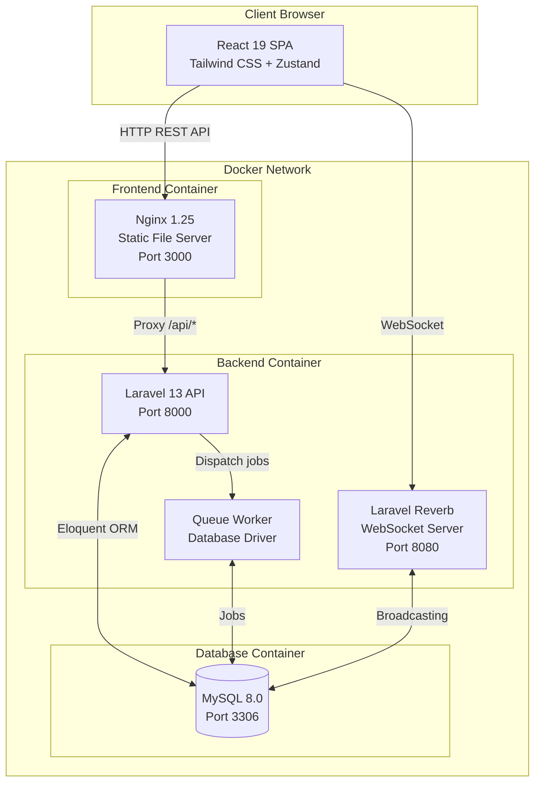
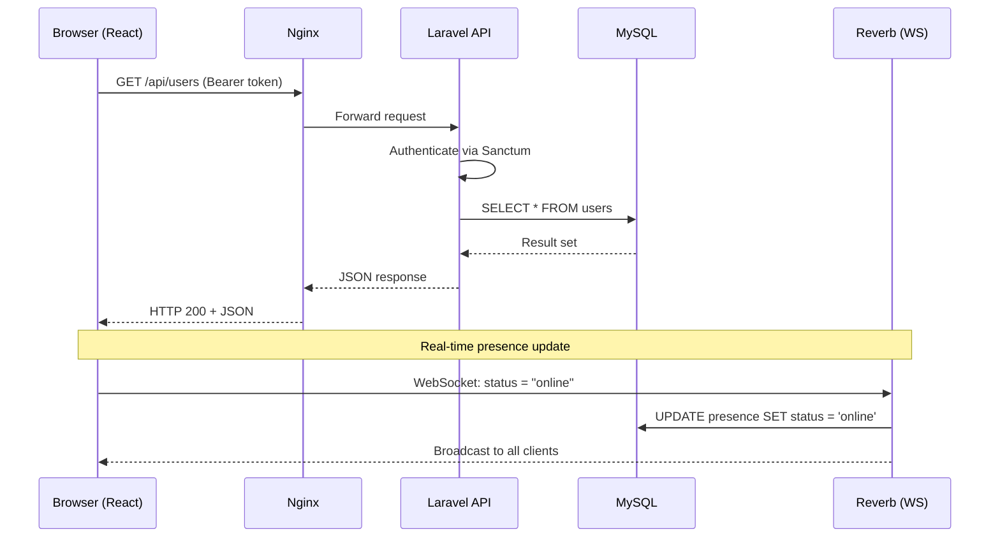
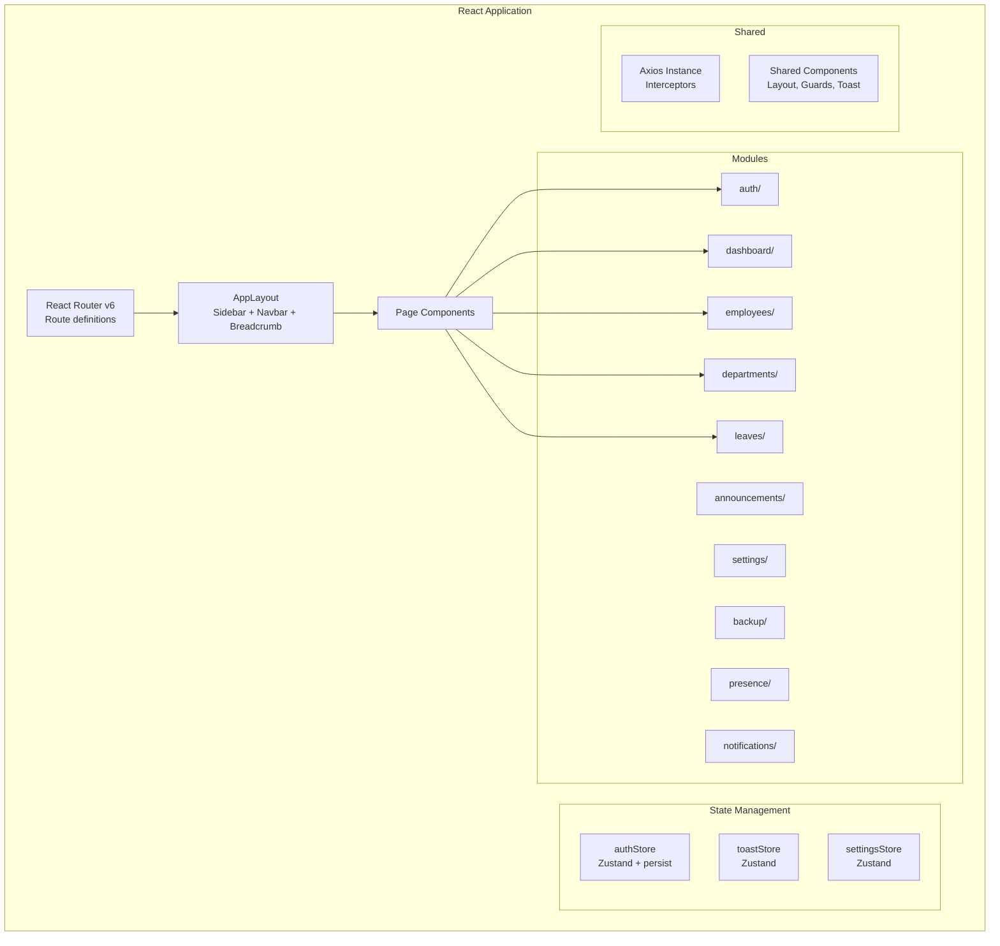

# Chapter 7 — System Architecture

## 7.1 High-Level Architecture

The EMS follows a **3-tier architecture** with clear separation:

| Tier            | Technology               | Responsibility                        |
| --------------- | ------------------------ | ------------------------------------- |
| Presentation    | React 19 SPA + Nginx     | User interface, routing, state        |
| Application     | Laravel 13 API           | Business logic, auth, REST endpoints  |
| Data            | MySQL 8.0                | Persistent storage, relational data   |

Additionally, **Laravel Reverb** provides a WebSocket layer for real-time features.

## 7.2 Architecture Diagram



## 7.3 Request–Response Flow



## 7.4 Backend Module Architecture

The Laravel backend uses a **modular monolith** pattern. Instead of a single `app/Http/Controllers/` directory, each domain feature is self-contained:

```
app/Modules/
├── Auth/           → Login, register, logout
├── User/           → Employee CRUD, profile
├── Department/     → Department CRUD
├── Leave/          → Leave application + approval
├── Announcement/   → Publish + list announcements
├── Presence/       → Status tracking (WebSocket)
├── Notification/   → In-app notification system
├── Dashboard/      → Stats, charts, reports
├── Setting/        → Feature flags
├── Backup/         → Database backup management
└── Demo/           → Sample data seeding/reset
```

Each module contains:

```
Module/
├── Controllers/    → HTTP request handlers
├── Models/         → Eloquent models
├── Resources/      → API resource transformers
├── Requests/       → Form request validation
├── Policies/       → Authorization policies
└── routes.php      → Module-specific route definitions
```

## 7.5 Frontend Architecture



## 7.6 API Design Pattern

All API endpoints follow **RESTful conventions**:

| Method | Endpoint                      | Description              | Auth    |
| ------ | ----------------------------- | ------------------------ | ------- |
| POST   | `/api/login`                  | Authenticate user        | Public  |
| POST   | `/api/register`               | Register new account     | Public  |
| POST   | `/api/logout`                 | Revoke token             | Token   |
| GET    | `/api/me`                     | Current user profile     | Token   |
| POST   | `/api/me`                     | Update own profile       | Token   |
| GET    | `/api/users`                  | List all employees       | Admin   |
| POST   | `/api/users`                  | Create employee          | Admin   |
| GET    | `/api/users/{id}`             | Get employee detail      | Admin   |
| PUT    | `/api/users/{id}`             | Update employee          | Admin   |
| DELETE | `/api/users/{id}`             | Delete employee          | Admin   |
| GET    | `/api/departments`            | List departments         | Token   |
| POST   | `/api/departments`            | Create department        | Admin   |
| PUT    | `/api/departments/{id}`       | Update department        | Admin   |
| DELETE | `/api/departments/{id}`       | Delete department        | Admin   |
| GET    | `/api/leaves`                 | List leaves              | Token   |
| POST   | `/api/leaves`                 | Apply for leave          | Token   |
| POST   | `/api/leaves/{id}/approve`    | Approve leave            | Admin   |
| POST   | `/api/leaves/{id}/reject`     | Reject leave             | Admin   |
| DELETE | `/api/leaves/{id}`            | Cancel leave             | Owner   |
| GET    | `/api/announcements`          | List announcements       | Token   |
| POST   | `/api/announcements`          | Create announcement      | Admin   |
| DELETE | `/api/announcements/{id}`     | Delete announcement      | Admin   |
| GET    | `/api/notifications`          | List notifications       | Token   |
| POST   | `/api/notifications/{id}/read`| Mark as read             | Token   |
| POST   | `/api/presence`               | Update presence status   | Token   |
| GET    | `/api/settings`               | Get settings             | Admin   |
| PUT    | `/api/settings`               | Update settings          | Admin   |
| GET    | `/api/backups`                | List backups             | Admin   |
| POST   | `/api/backups`                | Run backup               | Admin   |
| GET    | `/api/backups/{file}/download` | Download backup         | Admin   |
| GET    | `/api/dashboard/stats`        | Dashboard statistics     | Admin   |
| GET    | `/api/dashboard/pdf`          | Download PDF report      | Admin   |
| GET    | `/api/dashboard/excel`        | Download Excel report    | Admin   |
