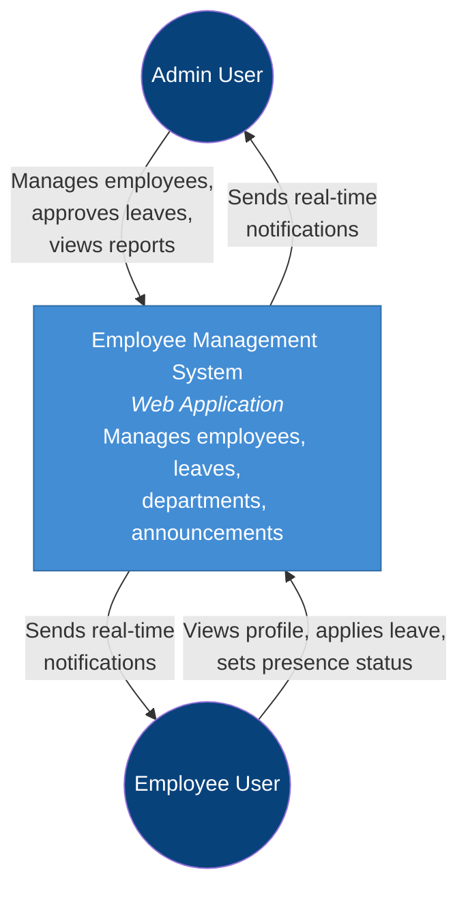
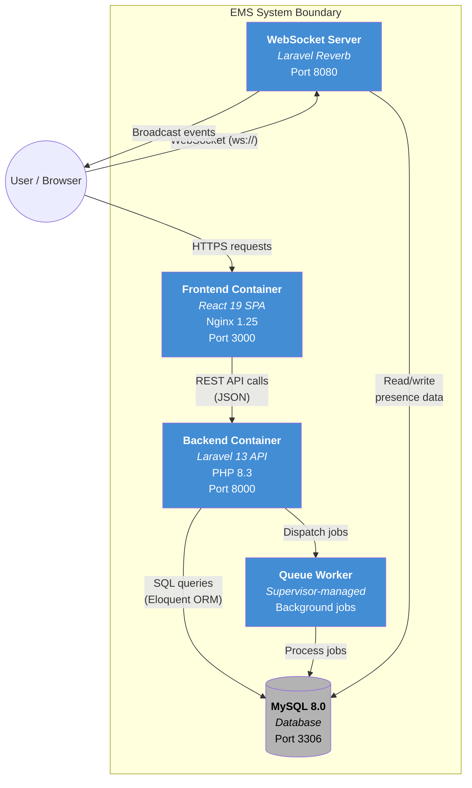
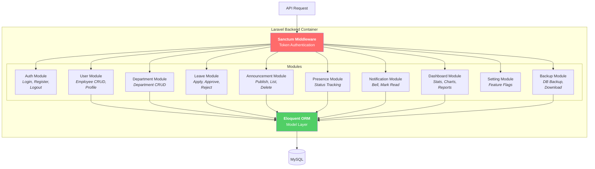
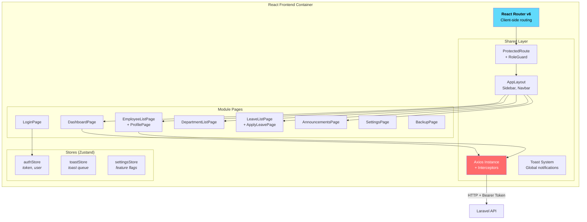
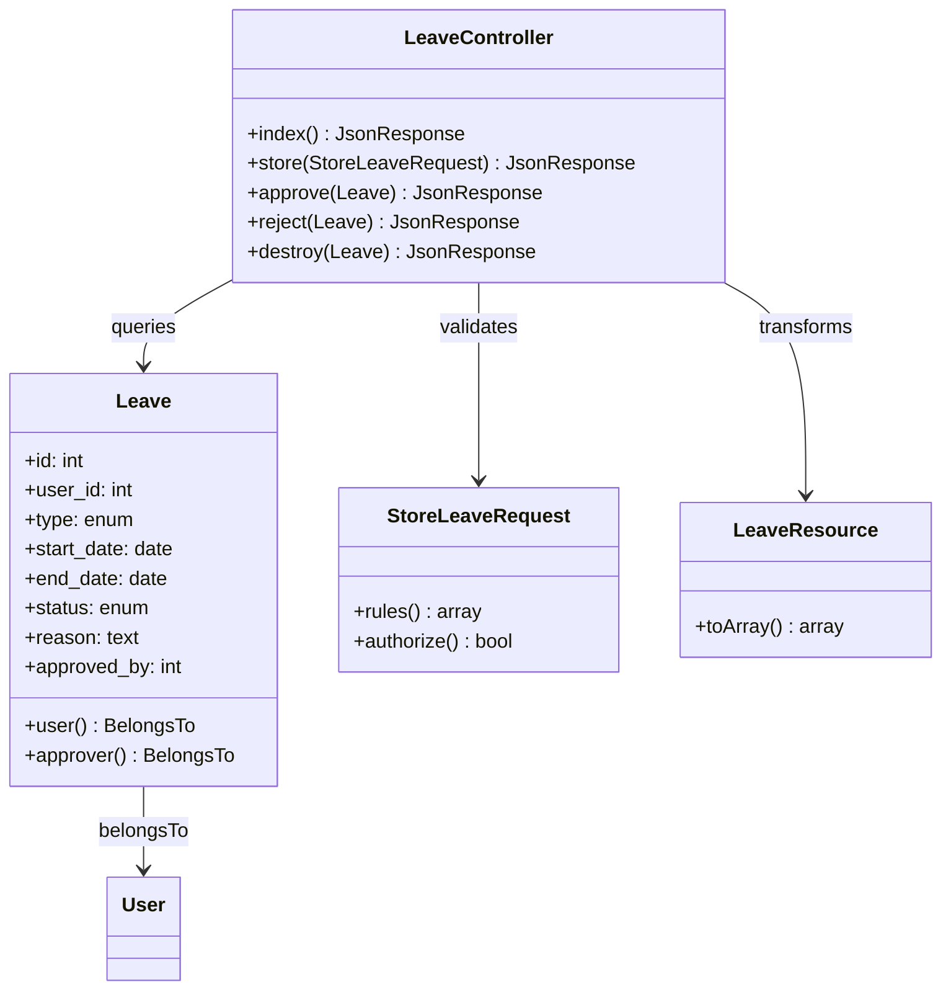

# Chapter 8 — C4 Model Diagrams

The **C4 model** (Context, Container, Component, Code) provides a hierarchical way to describe software architecture at different zoom levels.

---

## 8.1 Level 1 — System Context Diagram

Shows the EMS and its relationship with external actors.

---

## 8.2 Level 2 — Container Diagram

Zooms into the EMS to show the major containers (deployable units).

---

## 8.3 Level 3 — Component Diagram (Backend)

Zooms into the Laravel Backend container to show internal modules.

---

## 8.4 Level 3 — Component Diagram (Frontend)

Zooms into the React Frontend container.

---

## 8.5 Level 4 — Code Diagram (Leave Module Example)

Zooms into a single module to show classes and their relationships.

