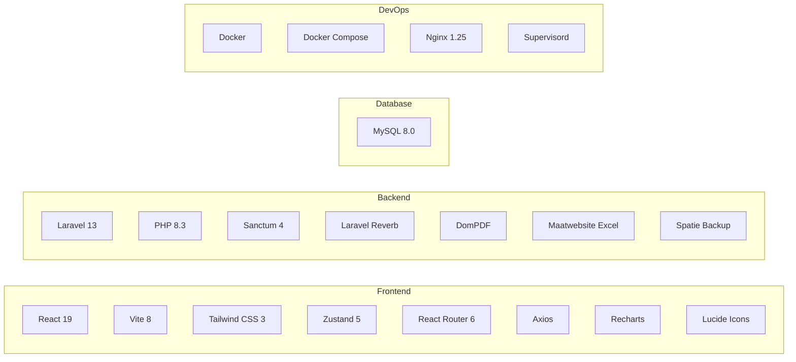

# Chapter 9 — Technology Stack

## 9.1 Complete Stack Overview



## 9.2 Frontend Technologies

| Technology          | Version | Purpose                                  |
| ------------------- | ------- | ---------------------------------------- |
| **React**           | 19.2    | UI component library (SPA)               |
| **Vite**            | 8.0     | Build tool and dev server (HMR)          |
| **Tailwind CSS**    | 3.4     | Utility-first CSS framework              |
| **React Router**    | 6.30    | Client-side routing and navigation       |
| **Zustand**         | 5.0     | Lightweight state management             |
| **Axios**           | 1.15    | HTTP client with interceptors            |
| **Recharts**        | 3.8     | Chart library for dashboard visuals      |
| **Lucide React**    | 1.8     | Icon library (tree-shakeable SVG icons)  |
| **Headless UI**     | 2.2     | Accessible UI primitives                 |
| **date-fns**        | 4.1     | Date formatting and manipulation         |

### Why These Choices?

- **React** — Industry-standard, component-based architecture, massive ecosystem.
- **Vite** — 10–100× faster than Webpack for development; native ES module support.
- **Tailwind CSS** — Rapid prototyping; no context-switching to CSS files; responsive by default.
- **Zustand** — Simpler than Redux; no boilerplate; built-in persistence middleware.

## 9.3 Backend Technologies

| Technology              | Version | Purpose                                  |
| ----------------------- | ------- | ---------------------------------------- |
| **PHP**                 | 8.3     | Server-side language                     |
| **Laravel**             | 13.0    | PHP web framework (MVC + API)            |
| **Laravel Sanctum**     | 4.3     | API token authentication                 |
| **Laravel Reverb**      | 1.10    | WebSocket server (real-time broadcasting)|
| **Eloquent ORM**        | —       | Database abstraction layer (built-in)    |
| **DomPDF**              | 3.1     | PDF report generation                    |
| **Maatwebsite Excel**   | 3.1     | Excel report export                      |
| **Spatie Backup**       | 10.2    | Database backup management               |
| **PHPUnit**             | 12.5    | Testing framework                        |
| **Faker**               | 1.23    | Test data generation and seeding         |

### Why These Choices?

- **Laravel** — Most popular PHP framework; elegant syntax; built-in auth, queue, broadcasting.
- **Sanctum** — Lightweight token auth; perfect for SPA + API architecture.
- **Reverb** — First-party Laravel WebSocket; no external services (Pusher) needed.

## 9.4 Database

| Technology | Version | Purpose                        |
| ---------- | ------- | ------------------------------ |
| **MySQL**  | 8.0     | Relational database management |

### Why MySQL?

- Wide adoption, proven reliability.
- Full support for foreign keys, transactions, indexing.
- Excellent Laravel/Eloquent integration.
- Free and open-source.

## 9.5 DevOps & Infrastructure

| Technology         | Version | Purpose                                    |
| ------------------ | ------- | ------------------------------------------ |
| **Docker**         | Latest  | Application containerization               |
| **Docker Compose** | v2      | Multi-container orchestration              |
| **Nginx**          | 1.25    | Static file server + reverse proxy         |
| **Supervisord**    | —       | Process manager (API + Queue + Reverb)     |
| **Node.js**        | 20      | Frontend build stage (multi-stage Docker)  |

### Docker Architecture

```
┌──────────────────────────────────────────────────┐
│                Docker Compose                     │
│                                                   │
│  ┌─────────────┐  ┌──────────────┐  ┌──────────┐ │
│  │  Frontend    │  │   Backend    │  │  MySQL   │ │
│  │  (Nginx)    │  │  (PHP-FPM)   │  │  8.0     │ │
│  │  :3000→80   │  │  :8000       │  │  :3306   │ │
│  │             │  │  :8080 (WS)  │  │          │ │
│  └─────────────┘  └──────────────┘  └──────────┘ │
│         │                │                │       │
│         └────────────────┼────────────────┘       │
│                    ems_network                     │
└──────────────────────────────────────────────────┘
```

## 9.6 Development Tools

| Tool              | Purpose                              |
| ----------------- | ------------------------------------ |
| **VS Code**       | Primary IDE                          |
| **GitHub Copilot**| AI-assisted development              |
| **Git**           | Version control                      |
| **Postman**       | API testing and documentation        |
| **Chrome DevTools**| Frontend debugging                  |
| **Make**          | Task runner (Makefile commands)       |
