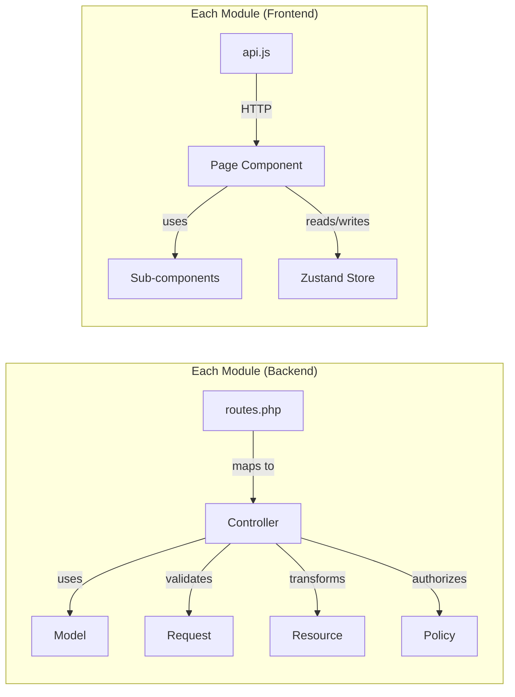

# Chapter 10 — Project Structure

## 10.1 Root Directory

```
Emplyee-management/
├── docker-compose.yml          # Multi-container orchestration
├── Makefile                    # Task runner (start, stop, build, etc.)
├── README.md                   # Project overview
├── documents/                  # 📂 This documentation folder
├── backend/                    # Laravel 13 API
└── frontend/                   # React 19 SPA
```

## 10.2 Backend Structure (Laravel 13)

```
backend/
├── app/
│   ├── Http/
│   │   └── Controllers/        # (Empty — controllers live in Modules)
│   ├── Models/
│   │   └── User.php            # Base User model
│   ├── Modules/                # ⭐ Modular architecture
│   │   ├── Auth/
│   │   │   ├── Controllers/
│   │   │   │   └── AuthController.php
│   │   │   └── routes.php
│   │   ├── User/
│   │   │   ├── Controllers/
│   │   │   │   └── UserController.php
│   │   │   ├── Models/
│   │   │   ├── Policies/
│   │   │   ├── Requests/
│   │   │   ├── Resources/
│   │   │   │   └── UserResource.php
│   │   │   └── routes.php
│   │   ├── Department/
│   │   │   ├── Controllers/
│   │   │   ├── Models/
│   │   │   ├── Resources/
│   │   │   └── routes.php
│   │   ├── Leave/
│   │   │   ├── Controllers/
│   │   │   ├── Models/
│   │   │   ├── Requests/
│   │   │   ├── Resources/
│   │   │   └── routes.php
│   │   ├── Announcement/
│   │   │   ├── Controllers/
│   │   │   ├── Models/
│   │   │   ├── Resources/
│   │   │   └── routes.php
│   │   ├── Presence/
│   │   │   ├── Controllers/
│   │   │   ├── Models/
│   │   │   └── routes.php
│   │   ├── Notification/
│   │   │   ├── Controllers/
│   │   │   ├── Models/
│   │   │   ├── Resources/
│   │   │   └── routes.php
│   │   ├── Dashboard/
│   │   │   ├── Controllers/
│   │   │   └── routes.php
│   │   ├── Setting/
│   │   │   ├── Controllers/
│   │   │   ├── Models/
│   │   │   └── routes.php
│   │   ├── Backup/
│   │   │   ├── Controllers/
│   │   │   ├── Models/
│   │   │   └── routes.php
│   │   └── Demo/
│   │       ├── Controllers/
│   │       └── routes.php
│   └── Providers/
│       ├── AppServiceProvider.php
│       └── ModuleServiceProvider.php    # Auto-registers all module routes
├── config/                     # Laravel configuration files
├── database/
│   ├── factories/              # Model factories for testing
│   ├── migrations/             # Database schema migrations (12 files)
│   └── seeders/                # Database seeders
├── docker/
│   ├── entrypoint.sh           # Container startup script
│   └── supervisord.conf        # Process manager config
├── routes/
│   ├── web.php                 # Web routes (minimal)
│   └── console.php             # Console commands
├── storage/                    # Logs, cache, uploads
├── tests/
│   ├── Feature/                # Feature/integration tests
│   └── Unit/                   # Unit tests
├── Dockerfile                  # Backend container definition
├── composer.json               # PHP dependencies
└── phpunit.xml                 # Test configuration
```

## 10.3 Frontend Structure (React 19)

```
frontend/
├── src/
│   ├── main.jsx                # Application entry point
│   ├── App.jsx                 # Root component
│   ├── index.css               # Global styles + CSS variables
│   ├── App.css                 # Component styles
│   ├── router/
│   │   └── index.jsx           # Route definitions + guards
│   ├── store/
│   │   ├── authStore.js        # Authentication state (Zustand + persist)
│   │   ├── toastStore.js       # Toast notification state
│   │   └── settingsStore.js    # Feature flag state
│   ├── shared/
│   │   ├── components/
│   │   │   ├── AppLayout.jsx       # Main layout (sidebar + navbar)
│   │   │   ├── Sidebar.jsx         # Navigation sidebar
│   │   │   ├── Navbar.jsx          # Top navigation bar
│   │   │   ├── Breadcrumb.jsx      # Breadcrumb navigation
│   │   │   ├── ProtectedRoute.jsx  # Auth guard
│   │   │   ├── RoleGuard.jsx       # Role-based guard
│   │   │   ├── ToastContainer.jsx  # Global toast renderer
│   │   │   └── FeatureDisabledBanner.jsx
│   │   ├── hooks/
│   │   │   └── useFeatureFlag.js   # Feature flag hook
│   │   └── utils/
│   │       └── axios.js            # Axios instance + interceptors
│   └── modules/
│       ├── auth/
│       │   └── pages/LoginPage.jsx
│       ├── dashboard/
│       │   ├── api.js
│       │   ├── pages/DashboardPage.jsx
│       │   └── components/
│       │       ├── StatCard.jsx
│       │       └── DepartmentChart.jsx
│       ├── employees/
│       │   ├── api.js
│       │   ├── pages/
│       │   │   ├── EmployeeListPage.jsx
│       │   │   └── EmployeeProfilePage.jsx
│       │   └── components/
│       │       └── CreateEmployeeModal.jsx
│       ├── departments/
│       │   ├── api.js
│       │   └── pages/DepartmentListPage.jsx
│       ├── leaves/
│       │   ├── api.js
│       │   └── pages/
│       │       ├── LeaveListPage.jsx
│       │       └── ApplyLeavePage.jsx
│       ├── announcements/
│       │   ├── api.js
│       │   └── pages/AnnouncementsPage.jsx
│       ├── presence/
│       │   └── components/
│       │       ├── StatusBadge.jsx
│       │       └── StatusDropdown.jsx
│       ├── notifications/
│       │   └── components/
│       │       └── NotificationBell.jsx
│       ├── settings/
│       │   ├── api.js
│       │   └── pages/SettingsPage.jsx
│       └── backup/
│           ├── api.js
│           └── pages/BackupPage.jsx
├── public/                     # Static assets
├── docker/
│   └── nginx.conf              # Nginx configuration
├── Dockerfile                  # Multi-stage build (Node → Nginx)
├── package.json                # npm dependencies
├── tailwind.config.js          # Tailwind configuration
├── vite.config.js              # Vite configuration
└── eslint.config.js            # Linting rules
```

## 10.4 Module Pattern Diagram


