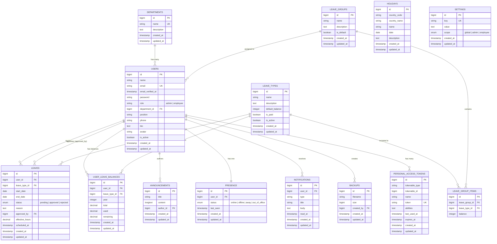
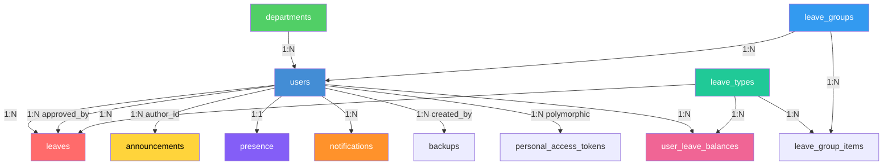

# Chapter 11 — Entity Relationship Diagram

## 11.1 Database Tables Overview

| Table                    | Description                              | Key Relations                  |
| ------------------------ | ---------------------------------------- | ------------------------------ |
| `users`                  | Employee/admin accounts                  | Has many leaves, notifications |
| `departments`            | Organizational departments               | Has many users                 |
| `leaves`                 | Leave requests                           | Belongs to user, leave type    |
| `leave_types`            | Leave categories (casual, sick, etc.)    | Has many leave group items     |
| `leave_groups`           | Leave balance policies                   | Has many items, has many users |
| `leave_group_items`      | Per-type balance within a group          | Belongs to group and type      |
| `user_leave_balances`    | Per-employee per-type leave balances     | Belongs to user and leave type |
| `holidays`               | Country-specific public holidays         | Standalone, filtered by country|
| `announcements`          | Organization-wide announcements          | Belongs to author (user)       |
| `presence`               | Real-time status tracking                | Belongs to user (1:1)          |
| `notifications`          | In-app notification records              | Belongs to user                |
| `settings`               | Key-value configuration (feature flags)  | Standalone                     |
| `backups`                | Database backup file records             | Created by user                |
| `personal_access_tokens` | Sanctum API tokens                       | Belongs to user (polymorphic)  |
| `sessions`               | Active browser sessions                  | Belongs to user                |
| `password_reset_tokens`  | Password reset tokens                    | Linked by email                |
| `jobs` / `failed_jobs`   | Queue job tables                         | System tables                  |
| `cache` / `cache_locks`  | Cache driver tables                      | System tables                  |

## 11.2 ER Diagram

## 11.3 Table Relationships Summary

## 11.4 Column Details

### Users Table — Extended Fields

| Column          | Type         | Nullable | Default    | Description                     |
| --------------- | ------------ | -------- | ---------- | ------------------------------- |
| `id`            | BIGINT       | No       | Auto       | Primary key                     |
| `name`          | VARCHAR(255) | No       | —          | Full name                       |
| `email`         | VARCHAR(255) | No       | —          | Unique email                    |
| `password`      | VARCHAR(255) | No       | —          | Bcrypt hashed                   |
| `role`          | VARCHAR(255) | No       | 'employee' | `admin` or `employee`           |
| `department_id` | BIGINT       | Yes      | NULL       | FK → departments.id             |
| `position`      | VARCHAR(255) | Yes      | NULL       | Job title                       |
| `phone`         | VARCHAR(255) | Yes      | NULL       | Contact number                  |
| `bio`           | TEXT         | Yes      | NULL       | Short biography                 |
| `avatar`        | VARCHAR(255) | Yes      | NULL       | Path to avatar image            |
| `is_active`     | BOOLEAN      | No       | true       | Soft active/inactive flag       |

### Leaves Table

| Column          | Type     | Nullable | Default   | Description                         |
| --------------- | -------- | -------- | --------- | ----------------------------------- |
| `id`            | BIGINT   | No       | Auto      | Primary key                         |
| `user_id`       | BIGINT   | No       | —         | FK → users.id (cascade delete)      |
| `leave_type_id` | BIGINT   | Yes      | NULL      | FK → leave_types.id                 |
| `start_date`    | DATE     | No       | —         | Leave start                         |
| `end_date`      | DATE     | No       | —         | Leave end                           |
| `status`        | VARCHAR  | No       | 'pending' | pending, approved, rejected         |
| `reason`        | TEXT     | Yes      | NULL      | Reason for leave                    |
| `approved_by`   | BIGINT   | Yes      | NULL      | FK → users.id (null on delete)      |
| `effective_hours`| DECIMAL | Yes      | NULL      | Calculated effective working hours   |
| `scheduled_at`  | TIMESTAMP| Yes      | NULL      | Scheduled processing time           |

### Leave Types Table

| Column            | Type         | Nullable | Default | Description                     |
| ----------------- | ------------ | -------- | ------- | ------------------------------- |
| `id`              | BIGINT       | No       | Auto    | Primary key                     |
| `name`            | VARCHAR(255) | No       | —       | Type name (e.g., Casual Leave)  |
| `description`     | TEXT         | Yes      | NULL    | Description of the leave type   |
| `default_balance` | INTEGER      | No       | 0       | Default annual balance (days)   |
| `is_paid`         | BOOLEAN      | No       | true    | Paid or unpaid leave            |
| `is_active`       | BOOLEAN      | No       | true    | Soft active/inactive flag       |

### Leave Groups Table

| Column       | Type         | Nullable | Default | Description                       |
| ------------ | ------------ | -------- | ------- | --------------------------------- |
| `id`         | BIGINT       | No       | Auto    | Primary key                       |
| `name`       | VARCHAR(255) | No       | —       | Group name (e.g., Standard, Senior)|
| `description`| TEXT         | Yes      | NULL    | Description of the group          |
| `is_default` | BOOLEAN      | No       | false   | Whether this is the default group |

### Holidays Table

| Column         | Type         | Nullable | Default | Description                      |
| -------------- | ------------ | -------- | ------- | -------------------------------- |
| `id`           | BIGINT       | No       | Auto    | Primary key                      |
| `country_code` | VARCHAR(2)   | No       | —       | ISO country code (IN, US, etc.)  |
| `country_name` | VARCHAR(255) | No       | —       | Country display name             |
| `name`         | VARCHAR(255) | No       | —       | Holiday name                     |
| `date`         | DATE         | No       | —       | Holiday date                     |
| `description`  | TEXT         | Yes      | NULL    | Optional description             |

### User Leave Balances Table

| Column          | Type     | Nullable | Default | Description                         |
| --------------- | -------- | -------- | ------- | ----------------------------------- |
| `id`            | BIGINT   | No       | Auto    | Primary key                         |
| `user_id`       | BIGINT   | No       | —       | FK → users.id                       |
| `leave_type_id` | BIGINT   | No       | —       | FK → leave_types.id                 |
| `year`          | INTEGER  | No       | —       | Balance year                        |
| `total`         | DECIMAL  | No       | 0       | Total allocated balance             |
| `used`          | DECIMAL  | No       | 0       | Used balance                        |
| `remaining`     | DECIMAL  | No       | 0       | Remaining balance                   |
