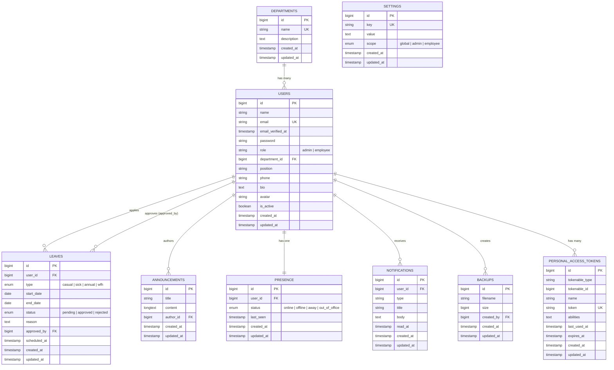
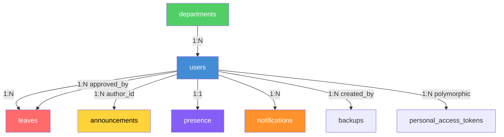

# Chapter 11 — Entity Relationship Diagram

## 11.1 Database Tables Overview

| Table                    | Description                              | Key Relations                  |
| ------------------------ | ---------------------------------------- | ------------------------------ |
| `users`                  | Employee/admin accounts                  | Has many leaves, notifications |
| `departments`            | Organizational departments               | Has many users                 |
| `leaves`                 | Leave requests                           | Belongs to user, approved by   |
| `announcements`          | Organization-wide announcements          | Belongs to author (user)       |
| `presence`               | Real-time status tracking                | Belongs to user (1:1)          |
| `notifications`          | In-app notification records              | Belongs to user                |
| `settings`               | Key-value configuration (feature flags)  | Standalone                     |
| `backups`                | Database backup file records             | Created by user                |
| `personal_access_tokens` | Sanctum API tokens                       | Belongs to user (polymorphic)  |
| `sessions`               | Active browser sessions                  | Belongs to user                |
| `password_reset_tokens`  | Password reset tokens                    | Linked by email                |
| `jobs` / `failed_jobs`   | Queue job tables                         | System tables                  |
| `cache` / `cache_locks`  | Cache driver tables                      | System tables                  |

## 11.2 ER Diagram

## 11.3 Table Relationships Summary

## 11.4 Column Details

### Users Table — Extended Fields

| Column          | Type         | Nullable | Default    | Description                     |
| --------------- | ------------ | -------- | ---------- | ------------------------------- |
| `id`            | BIGINT       | No       | Auto       | Primary key                     |
| `name`          | VARCHAR(255) | No       | —          | Full name                       |
| `email`         | VARCHAR(255) | No       | —          | Unique email                    |
| `password`      | VARCHAR(255) | No       | —          | Bcrypt hashed                   |
| `role`          | VARCHAR(255) | No       | 'employee' | `admin` or `employee`           |
| `department_id` | BIGINT       | Yes      | NULL       | FK → departments.id             |
| `position`      | VARCHAR(255) | Yes      | NULL       | Job title                       |
| `phone`         | VARCHAR(255) | Yes      | NULL       | Contact number                  |
| `bio`           | TEXT         | Yes      | NULL       | Short biography                 |
| `avatar`        | VARCHAR(255) | Yes      | NULL       | Path to avatar image            |
| `is_active`     | BOOLEAN      | No       | true       | Soft active/inactive flag       |

### Leaves Table

| Column         | Type     | Nullable | Default   | Description                         |
| -------------- | -------- | -------- | --------- | ----------------------------------- |
| `id`           | BIGINT   | No       | Auto      | Primary key                         |
| `user_id`      | BIGINT   | No       | —         | FK → users.id (cascade delete)      |
| `type`         | ENUM     | No       | —         | casual, sick, annual, wfh           |
| `start_date`   | DATE     | No       | —         | Leave start                         |
| `end_date`     | DATE     | No       | —         | Leave end                           |
| `status`       | ENUM     | No       | 'pending' | pending, approved, rejected         |
| `reason`       | TEXT     | Yes      | NULL      | Reason for leave                    |
| `approved_by`  | BIGINT   | Yes      | NULL      | FK → users.id (null on delete)      |
| `scheduled_at` | TIMESTAMP| Yes      | NULL      | Scheduled processing time           |
