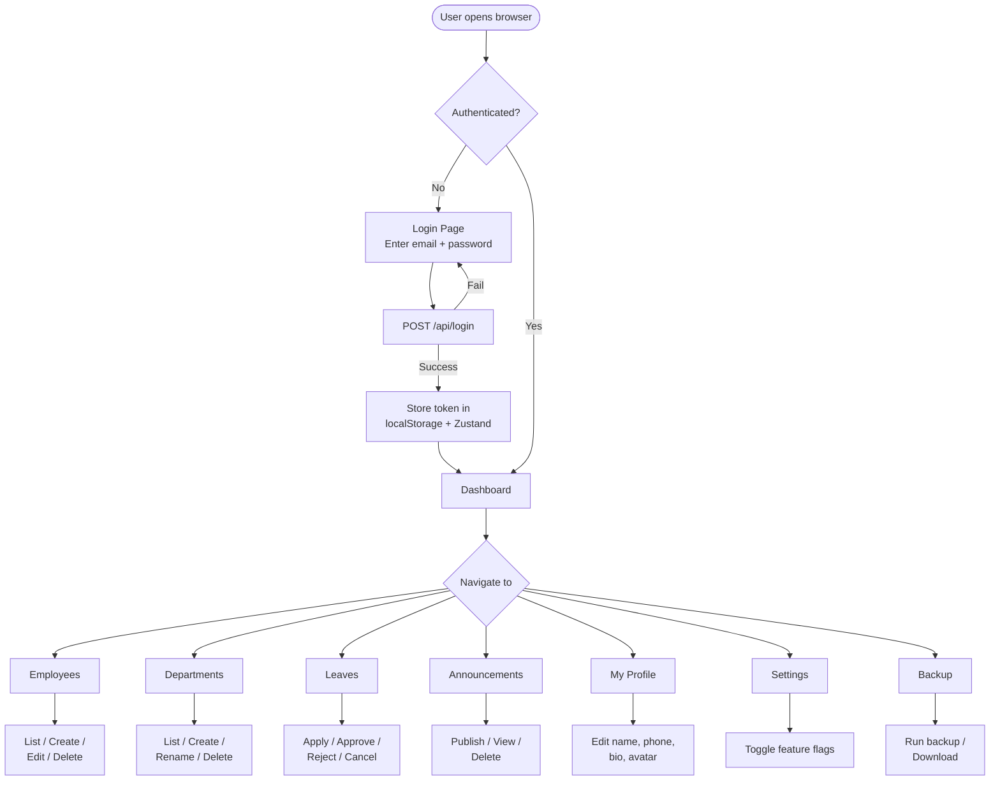
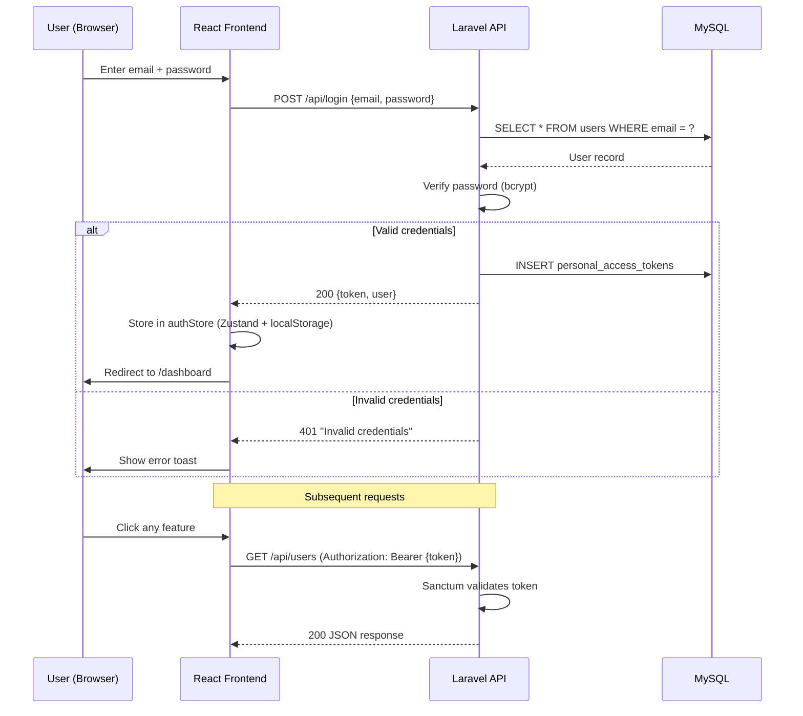
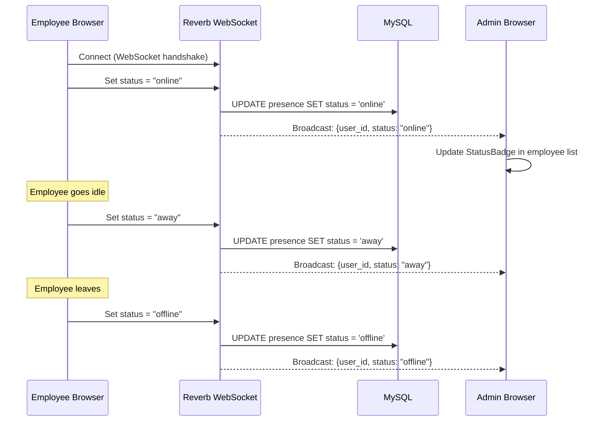
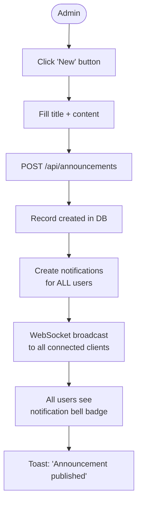
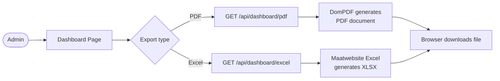
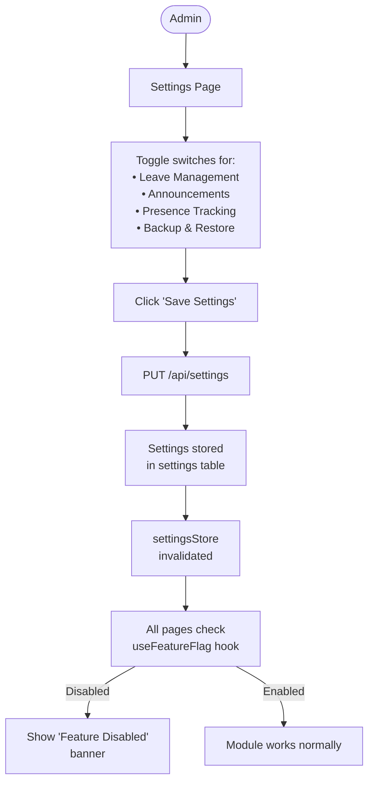

# Chapter 12 — System Flow Diagrams

## 12.1 Overall System Flow



## 12.2 Authentication Flow



## 12.3 Leave Management Flow

```mermaid
flowchart TB
    subgraph "Employee Actions"
        E1([Employee]) --> E2[Open Leave Page]
        E2 --> E3[Click 'Apply Leave']
        E3 --> E4[Fill form:<br>Type, Dates, Reason]
        E4 --> E5[POST /api/leaves]
        E5 --> E6[Leave created<br>Status: PENDING]
        E6 --> E7[Toast: 'Leave submitted']
    end

    subgraph "System"
        E6 --> N1[Create notification<br>for all admins]
        N1 --> N2[WebSocket broadcast<br>to admin clients]
    end

    subgraph "Admin Actions"
        A1([Admin]) --> A2[View Leave List]
        A2 --> A3{Action?}
        A3 -->|Approve| A4[POST /leaves/{id}/approve]
        A3 -->|Reject| A5[POST /leaves/{id}/reject]
        A4 --> A6[Status → APPROVED]
        A5 --> A7[Status → REJECTED]
        A6 --> A8[Notify employee]
        A7 --> A8
    end

    N2 -.->|Real-time bell| A2

    style E6 fill:#FFD43B,color:#000
    style A6 fill:#51CF66,color:#fff
    style A7 fill:#FF6B6B,color:#fff
```

## 12.4 Employee CRUD Flow

```mermaid
flowchart LR
    subgraph "Admin"
        A1[Employee List Page] --> A2{Action}
        A2 -->|Create| A3[Open Modal<br>Fill form]
        A2 -->|Edit| A4[Navigate to<br>Profile Page]
        A2 -->|Delete| A5[Confirm dialog]

        A3 --> A6[POST /api/users]
        A4 --> A7[PUT /api/users/{id}]
        A5 --> A8[DELETE /api/users/{id}]

        A6 -->|Success| A9[Toast + Refresh list]
        A7 -->|Success| A9
        A8 -->|Success| A9
    end
```

## 12.5 Presence Tracking Flow



## 12.6 Announcement Publishing Flow



## 12.7 Backup Flow

```mermaid
flowchart LR
    A1([Admin]) --> A2[Backup Page]
    A2 --> A3[Click 'Run Backup']
    A3 --> A4[POST /api/backups]
    A4 --> A5[Spatie Backup<br>runs mysqldump]
    A5 --> A6[File saved to<br>storage/backups/]
    A6 --> A7[Record inserted<br>in backups table]
    A7 --> A8[Toast: 'Backup started']
    A8 --> A9[List refreshes<br>after 3 seconds]

    A2 --> A10[Click 'Download']
    A10 --> A11[GET /backups/{file}/download]
    A11 --> A12[Browser downloads<br>.sql/.zip file]
```

## 12.8 Report Export Flow



## 12.9 Feature Flag Flow


