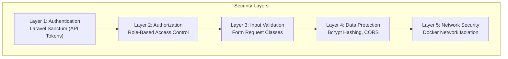
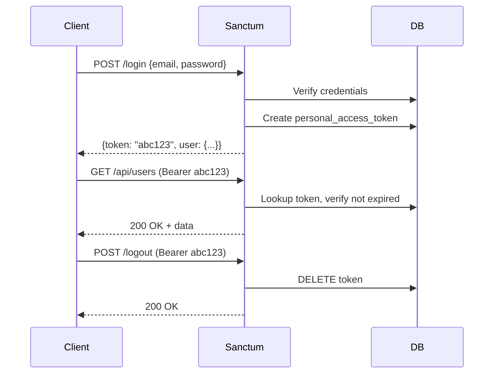
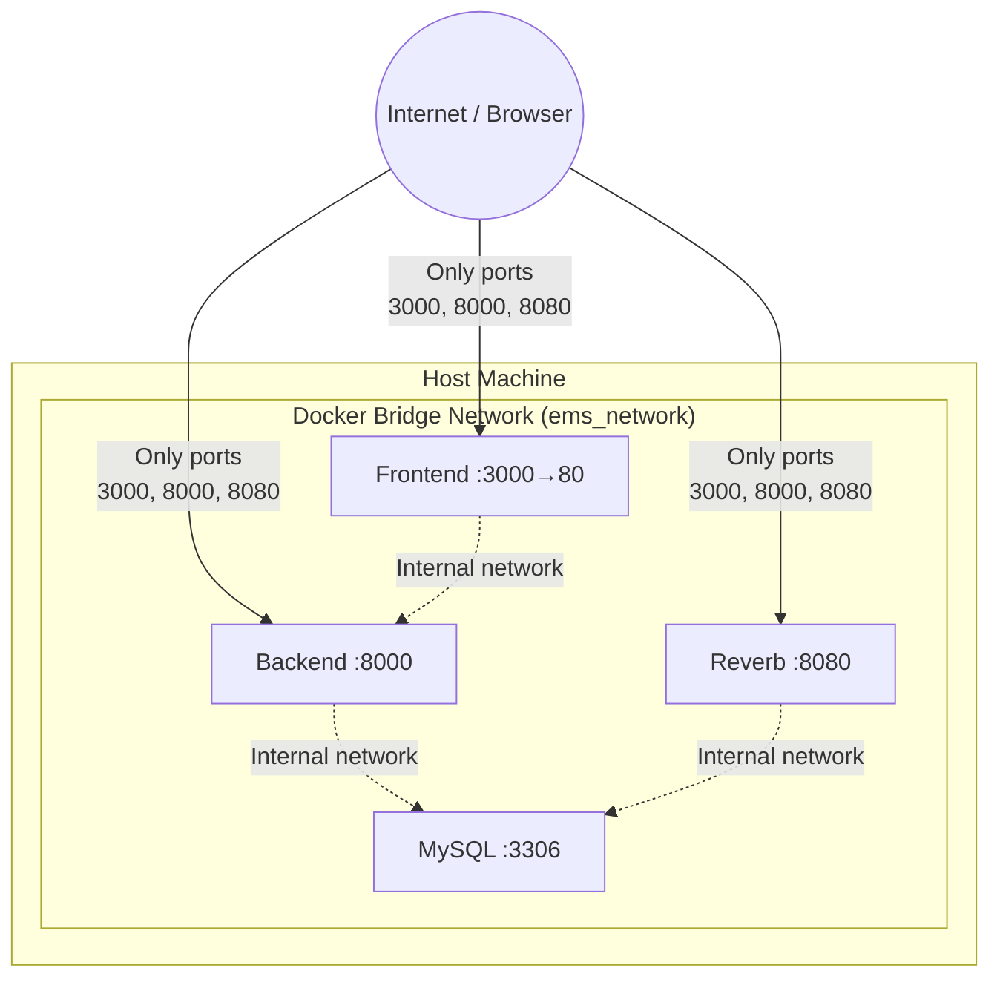

# Chapter 13 — Security

## 13.1 Security Architecture Overview



## 13.2 Authentication

### Token-Based Authentication (Laravel Sanctum)

| Aspect                | Implementation                                     |
| --------------------- | -------------------------------------------------- |
| **Mechanism**         | Bearer token via `personal_access_tokens` table    |
| **Token generation**  | On successful login (`POST /api/login`)            |
| **Token storage**     | Client stores in `localStorage` (Zustand persist)  |
| **Token transmission**| `Authorization: Bearer {token}` header on every request |
| **Token revocation**  | On logout, token is deleted from database           |
| **401 handling**      | Axios interceptor clears token and redirects to `/login` |

### Authentication Flow



## 13.3 Authorization (RBAC)

Two roles with distinct access levels:

| Resource          | Employee                    | Admin                        |
| ----------------- | --------------------------- | ---------------------------- |
| Dashboard         | ❌ No access                | ✅ Full access               |
| Own profile       | ✅ View & edit              | ✅ View & edit               |
| Other employees   | ❌ No access                | ✅ Full CRUD (admin accounts cannot be deleted) |
| Departments       | ❌ No access                | ✅ Full CRUD                 |
| Leave (own)       | ✅ Apply & cancel           | ✅ Apply & cancel            |
| Leave (others)    | ❌ No access                | ✅ Approve & reject          |
| Announcements     | ✅ View only                | ✅ Create & delete           |
| Settings          | ❌ No access                | ✅ Full access               |
| Backup            | ❌ No access                | ✅ Full access               |

### Enforcement Points

1. **Backend** — Route middleware checks role (`admin` middleware on admin-only routes).
2. **Backend** — Laravel Policies authorize individual actions on models.
3. **Frontend** — `RoleGuard` component wraps admin-only routes; unauthorized users are redirected.
4. **Frontend** — Sidebar only shows links the user's role can access.

## 13.4 Input Validation

All incoming data is validated using **Laravel Form Request** classes:

```php
// Example: StoreLeaveRequest
public function rules(): array
{
    return [
        'type'       => 'required|in:casual,sick,annual,wfh',
        'start_date' => 'required|date|after_or_equal:today',
        'end_date'   => 'required|date|after_or_equal:start_date',
        'reason'     => 'nullable|string|max:500',
    ];
}
```

| Validation Type     | Where Applied                          |
| ------------------- | -------------------------------------- |
| Required fields     | All create/update endpoints            |
| Email format        | User registration, login               |
| Enum validation     | Leave type, status, presence status    |
| Date validation     | Leave start/end dates                  |
| String length       | Names, titles, reasons                 |
| File validation     | Avatar upload (image mime, max size)   |
| Unique constraints  | Email, department name                 |

## 13.5 Data Protection

| Measure                 | Implementation                                  |
| ----------------------- | ------------------------------------------------ |
| **Password hashing**    | Bcrypt via Laravel's `Hash::make()` (auto-cast)  |
| **SQL injection prevention** | Eloquent ORM uses parameterized queries     |
| **XSS prevention**      | React auto-escapes JSX output; no `dangerouslySetInnerHTML` |
| **CORS**                | Configured in `config/cors.php`; only allowed origins |
| **Mass assignment**     | `#[Fillable]` attribute on models limits writable fields |
| **Hidden fields**       | `#[Hidden(['password', 'remember_token'])]` on User model |
| **CSRF**                | Not needed (stateless API with Bearer tokens)     |

## 13.6 Network Security (Docker)



| Security Measure            | Description                                        |
| --------------------------- | -------------------------------------------------- |
| Internal Docker network     | Containers communicate via `ems_network`; DB not exposed by default |
| Exposed ports limited       | Only 3000, 8000, 8080 mapped to host               |
| Multi-stage build           | Node.js build tools not present in production Nginx image |
| Non-root container process  | Nginx and PHP-FPM run as non-root users             |

## 13.7 OWASP Top 10 Coverage

| # | OWASP Risk                      | Mitigation in EMS                             |
| - | ------------------------------- | --------------------------------------------- |
| 1 | Broken Access Control           | Sanctum auth + role middleware + policies      |
| 2 | Cryptographic Failures          | Bcrypt password hashing; no plain-text secrets |
| 3 | Injection                       | Eloquent ORM (parameterized queries)           |
| 4 | Insecure Design                 | Modular architecture; input validation         |
| 5 | Security Misconfiguration       | Docker isolation; `.env` not exposed           |
| 6 | Vulnerable Components           | Managed via Composer/npm; latest versions      |
| 7 | Authentication Failures         | Token-based auth; 401 auto-logout              |
| 8 | Data Integrity Failures         | Foreign key constraints; cascade deletes       |
| 9 | Logging & Monitoring Failures   | Laravel logging to `storage/logs/`             |
| 10| Server-Side Request Forgery     | No external URL fetching; no SSRF vectors      |
