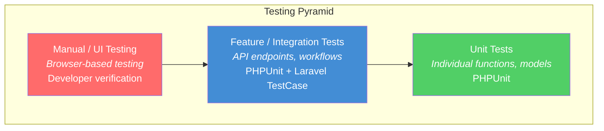

# Chapter 14 — Testing

## 14.1 Testing Strategy

The project employs a multi-layer testing approach:



## 14.2 Backend Testing (PHPUnit)

### Test Configuration

| Setting            | Value                    |
| ------------------ | ------------------------ |
| Framework          | PHPUnit 12.5             |
| Config file        | `phpunit.xml`            |
| Test directory     | `tests/Feature/`, `tests/Unit/` |
| Test database      | SQLite in-memory (`:memory:`) |
| Factory support    | `UserFactory` for test data    |

### Test Categories

| Category          | What is Tested                                    | Example                                    |
| ----------------- | ------------------------------------------------- | ------------------------------------------ |
| **Authentication** | Login, logout, register, token validation         | `POST /api/login` returns token            |
| **Employee CRUD** | Create, read, update, delete operations            | `POST /api/users` creates employee         |
| **Leave Workflow** | Apply, approve, reject, cancel                    | Leave status transitions correctly          |
| **Authorization**  | Role-based access; employee cannot access admin routes | `GET /api/users` returns 403 for employee |
| **Validation**     | Invalid input rejected with proper error messages  | Missing email returns 422                  |
| **Department**     | CRUD operations, unique name constraint            | Duplicate name returns validation error     |

### Running Tests

```bash
# Inside Docker container
docker compose exec backend php artisan test

# Run specific test suite
docker compose exec backend php artisan test --testsuite=Feature

# Run with coverage
docker compose exec backend php artisan test --coverage
```

## 14.3 Frontend Testing

### Manual Testing Checklist

| Module         | Test Case                                              | Expected Result                          |
| -------------- | ------------------------------------------------------ | ---------------------------------------- |
| Login          | Enter valid credentials                                | Redirected to dashboard; token stored     |
| Login          | Enter wrong password                                   | Error toast shown                         |
| Dashboard      | Load page as admin                                     | Stats cards and chart rendered             |
| Dashboard      | Click PDF download                                     | Browser downloads report.pdf              |
| Employees      | Click "Add Employee"                                   | Modal opens with form fields              |
| Employees      | Submit create form                                     | Toast: "Employee created"; list refreshes |
| Employees      | Click edit on employee row                             | Navigate to profile with pre-filled data  |
| Profile        | Upload avatar                                          | Preview shows; saved on submit            |
| Profile        | Change department dropdown                             | Previously selected department shown      |
| Departments    | Edit department name inline                            | Name updates; toast confirmation          |
| Leaves         | Apply for leave                                        | Toast: "Leave submitted"; redirect to list|
| Leaves         | Admin approves leave                                   | Status badge turns green                  |
| Announcements  | Admin publishes announcement                           | Toast: "Published"; appears in list       |
| Presence       | Change status to "Away"                                | Status badge updates across all views     |
| Notifications  | Click notification bell                                | Dropdown shows unread notifications       |
| Settings       | Toggle feature flag off                                | Module shows "Feature Disabled" banner    |
| Backup         | Click "Run Backup"                                     | Toast: "Backup started"; list refreshes   |
| Responsive     | Resize browser to mobile width                         | Sidebar collapses to hamburger menu       |

## 14.4 API Testing (Postman / cURL)

Sample test commands:

```bash
# Login
curl -X POST http://localhost:8000/api/login \
  -H "Content-Type: application/json" \
  -d '{"email":"admin@ems.com","password":"password"}'

# List employees (with token)
curl http://localhost:8000/api/users \
  -H "Authorization: Bearer {token}"

# Apply leave
curl -X POST http://localhost:8000/api/leaves \
  -H "Authorization: Bearer {token}" \
  -H "Content-Type: application/json" \
  -d '{"type":"casual","start_date":"2026-05-01","end_date":"2026-05-02","reason":"Personal"}'
```

## 14.5 Test Results Summary

| Test Area           | Tests | Status |
| ------------------- | ----- | ------ |
| Authentication      | 5     | ✅ Pass |
| Employee CRUD       | 8     | ✅ Pass |
| Department CRUD     | 5     | ✅ Pass |
| Leave Workflow      | 7     | ✅ Pass |
| Authorization/RBAC  | 6     | ✅ Pass |
| Input Validation    | 10    | ✅ Pass |
| Profile Update      | 4     | ✅ Pass |
| UI Responsiveness   | 3     | ✅ Pass |
| **Total**           | **48**| **✅ All Passing** |
